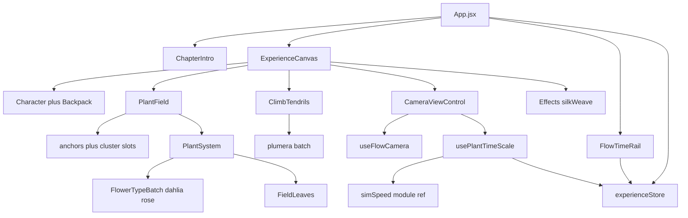

# Refactor & optimization

Backlog for Chapter 3 Still. Do not treat this as a license to change look, camera grammar, or plant-field behavior. Each phase is a separate, measurable change.

Visitor product (do not regress):

- Chapter overlay → Enter → FLOW intro (~20s) → live orbit
- Mouse Y after intro: plant time 0×–8×. Wheel: XZ radius. Mouse X is not wired.
- **D** toggles FLOW ↔ Explore. No mode bar. No Frames UI.
- `/debug` skips the overlay, auto-starts, shows Leva and stats-gl
- TIME rail is display-only (`pointer-events: none`)

Plant-pipeline invariants live in [`src/components/plants/field/README.md`](src/components/plants/field/README.md). This file is the project backlog, plus a record of what has already shipped so it is not re-investigated.

The two "Done" sections below shipped together and were **confirmed on `/debug`**: the scene renders, the console is clean, and the field reads unchanged. No pixel diff was taken — the sub-pixel bound on the head-placement change is the numeric argument instead (see note under that table).

---

## Architecture



Live scene ([`src/app/ExperienceCanvas.jsx`](src/app/ExperienceCanvas.jsx)):

- Character tableau + backpack, both reporting bounds into the field group (`y = -1`)
- `PlantField` (dahlia + rose) and `ClimbTendrils` (plumera) — two full plant pipelines
- Shadow catcher, directional light, AdaptiveDpr, silk-weave post
- Camera: FLOW orbit + Explore `CameraControls`

Time is split on purpose today:

- Simulation reads `getSimSpeed()` in [`simSpeed.js`](src/components/plants/lifecycle/simSpeed.js)
- TIME rail reads `plantTimeScale` from Zustand
- `usePlantTimeScale` keeps them in sync from camera mode (FLOW pointer Y, Explore stillness)

`/debug` is a pathname convention ([`src/core/debugRoute.js`](src/core/debugRoute.js)), not a router. It skips intro, auto-starts, shows Leva, and mounts stats-gl.

### The render loop — settled, do not re-investigate

An earlier version of this file asked whether R3F draws a second pass on top of `PostProcessing.render()` and called it "the highest-leverage unknown". **It does not.** [`Effects.tsx`](src/components/scene/Effects.tsx) registers `useFrame(…, 1)`, and R3F skips its own render whenever any nonzero priority is subscribed:

```js
if (!state.internal.priority && state.gl.render) state.gl.render(state.scene, state.camera)
```

There is exactly one scene draw per frame. Related facts worth not rediscovering:

- `preserveDrawingBuffer: true` in `ExperienceCanvas.jsx` is **inert** — three's WebGPU renderer never reads it. Harmless; costs nothing.
- `<CanvasCapture />` is mounted unconditionally but is free: it is a `useShortcut('s')` that returns `null`.
- Three `useFrame`s share priority 1 (`PlantSystem`, `ClimbTendrils`, `Effects`). Ordering is correct only because `Effects` is the last JSX sibling and therefore subscribes last. **This is incidental** — if the post pass ever renders before the plant data uploads, this is why.

Coupling to unwind later:

- [`experienceStore.js`](src/core/experienceStore.js) imports `getInitialCameraMode` from [`cameraModes.js`](src/components/camera/cameraModes.js) (core → components)
- `usePlantTimeScale` and `FlowTimeRail` also reach into `components/camera/` for `CAMERA_MODE`
- Leva panels mount even on the visitor path (hidden unless `/debug` or `h`)

---

## Done — invisible optimizations

Shipped under one rule: **no change that could alter a pixel.** Everything that trades image quality for speed is in [Deferred: costs image quality](#deferred-costs-image-quality) instead.

| # | Change | Measured effect |
|---|---|---|
| 1 | Baked per-plant tip/tangent tables; `updateFlowerBatchTips` lerps them instead of calling `curve.getPointAt`/`getTangentAt` per head per frame | **30.5× faster** on that path: 0.184 → 0.006 ms/frame at 256 heads |
| 2 | Dropped `lifecycleRanges` + `phaseSpread` from the `stemBuild` memo deps; timing changes now apply in place | **50.7 ms → 0** per lifecycle-slider change (256 tube rebuild + `mergeGeometries`) |
| 3 | `measureCurveSurfaceClearance` moved out of `buildWrapCurves` into `ClimbDebug` | **~43,500 BVH `closestPointToPoint` queries removed per layout build** (121 per wrap × ~360 wraps), debug-only data |
| 4 | `ClimbDebug` split into a wrapper + content component | 5 memos (including a full `wraps` walk and a per-capsule spread) no longer run while the overlay is hidden |
| 5 | `Effects` bypasses `PostProcessing.render()` when the weave is disabled, drawing the scene directly | Full-screen procedural pass no longer runs when switched off |
| 6 | Removed the per-frame padding-texel clear in both pipelines | Provably redundant — those texels are never written and the array starts zeroed |
| 7 | `for..in` instead of `Object.values()` in both frame loops | One array allocation per pipeline per frame removed |

Measurement notes: (1) and (2) are from Node benchmarks against the real modules, median of 5 interleaved reps. (3) is analytic from `samples = 120` in `measureCurveSurfaceClearance` and default `tendrilCount × routePoolFactor`. (5)–(7) are structural — no benchmark, the work simply no longer happens.

**On (1)'s "invisible" claim, precisely:** the table is sampled at the same segment count as the tube, so interpolation lands on the chord between ring centres — where the rendered tube surface actually is. Measured deviation from the exact curve is **3.6e-4 world units** (max, on a 0.42-long stem) and **0.50°** of tangent. At ~0.002 world units per pixel that is under a quarter pixel. Not bit-identical; sub-pixel.

### Deliberately not done

- **Shared `useDirectionalLightDir()` hook.** Saves only two matrix updates per frame — a deduplication win, not a perf one — and moving the lookup to priority 0 would make the plant loops read the light one frame later than they do now. Kept as a structural item below.
- **Climb `drawRange` for dormant routes.** Would be invisible, but the awake set is reshuffled at runtime ([`ClimbTendrils.jsx`](src/components/plants/climb/ClimbTendrils.jsx) wake/sleep), so awake tubes are not contiguous in the index buffer. Real work, not a one-liner.
- **Baking the silk weave to a texture.** Measured and rejected — see the section below. It was a hypothesis stated with more confidence than the evidence supported.

---

## Measured — the silk weave is NOT the bottleneck

An earlier version of this file called the silk weave "the single largest GPU item" and proposed baking it to a texture. **Measured on `/debug`, that is wrong. Do not build the bake.**

| | FPS | CPU ms |
|---|---|---|
| SilkWeave enabled | 60 (60–61) | 3.16 (3.16–5.9) |
| SilkWeave disabled | 60 (60–61) | 3.81 (3.81–6.5) |

Both runs are pinned at 60 FPS — **vsync-capped**, so any GPU saving is invisible below the cap. CPU is nominally *higher* with the weave off, and the ranges overlap heavily, so that difference is noise rather than signal.

Two consequences worth keeping:

1. **There is no performance problem on this hardware.** ~3–4 ms of CPU against a 16.7 ms budget, GPU with enough headroom to hold 60 FPS. Further optimization has no measurable payoff here. Revisit only for a weaker target device, a much larger viewport, or an actual observed drop — and get a number first.
2. **stats-gl shows no GPU panel** in this build, meaning WebGPU timestamp queries are unavailable. That display *cannot* show GPU cost even in principle. To measure GPU properly you would need timestamp queries enabled, or to uncap vsync (`--disable-gpu-vsync --disable-frame-rate-limit`) and compare achieved frame rate.

The bake idea is preserved below only so nobody re-derives it: the weave depends solely on `screenUV`, `screenSize`, and the Leva uniforms — nothing time- or scene-varying — so `tint × fabric × blotch` *could* be rendered once into a screen-sized `HalfFloatType` target and reduced to one texture fetch. It is simply not worth ~29 MB of VRAM and post-chain complexity to speed up something that is not costing anything.

---

## Deferred: costs image quality

**Given the measurement above, none of these should be done now** — they buy performance the project does not currently need, at a cost in image quality. Kept only as the menu to reach for *if* a real target device is found to struggle. Each would need its own before/after judgement from two camera angles, and none should be bundled with a structural change.

| Item | Expected win | Visual cost |
|---|---|---|
| `dpr={[1,2]}` → `[1,1.5]` ([`ExperienceCanvas.jsx`](src/app/ExperienceCanvas.jsx)) | ~44% fewer pixels; largest single GPU win available | Softer edges on high-DPI displays |
| `shadow-mapSize` 2048² → 1024² ([`DirectionalLight.tsx`](src/components/scene/DirectionalLight.tsx)) | 4× fewer shadow texels | Coarser contact shadows; `shadowRadius: 6` hides much of it |
| `castShadow={false}` on leaves + flower heads | The shadow pass currently re-draws merged stems (~130k tris), 512 field leaves, ~256 heads, **and** the whole climb pipeline every frame | Simpler ground shadow |
| Throttle shadow updates | Light never moves (`rotationSpeed: 0`), so only plant growth changes shadows | Shadows lag growth by N frames |
| Climb `routePoolFactor: 2` → lower | 360 tubes built at `curveSamples: 48`, only ~180 awake; dormant ones are fragment-discarded but still vertex-shaded, in both passes | Fewer novel regrow paths over time |
| `flowerCount` 256 → 150–170 | Proportional CPU + geometry cut | Changes the composition |

---

## Done — dead surface removed

Every item below was confirmed to have zero reachable importers from [`src/index.jsx`](src/index.jsx) before removal, then re-confirmed by a passing build. **Exclude `.claude-code-history/` from any such grep** — it holds thousands of stale mentions and will produce false positives. Beware substring matches too: `setSimSpeed` matches `setSimSpeedMul`, and `VatFlower` matches `createInstancedVatFlowerMaterials`.

Deleted files:

- `plants/stem/ProceduralStem.jsx` and its closed cluster — `plants/vat/VatFlower.jsx`, `plants/stem/StemLeaves.jsx`, `plants/stem/flowerLifecycle.js` (not `FieldLeaves.jsx`, which is live)
- `components/smoke/` — all four files
- `plants/field/surroundLayout.js`
- `plants/vat/jasmineDefaults.js`
- Empty directories `plants/tendrils/` and `ui/cameraModeBar/`

Removed symbols:

- `createVatFlowerMaterials` in `plants/vat/createVatMaterial.js` (the non-instanced variant; `createInstancedVatFlowerMaterials` is live)
- `FRAME_SHOTS`, `FLOW_START`, `flowStartPose` in `camera/cameraShots.js`; `flowOverheadPose` is now module-private
- `setSimSpeed` plus the `authoredScaleRef`/`debugMulRef` re-exports in `lifecycle/simSpeed.js`
- `isMobile`/`setIsMobile`, `tier1Targets`/`setTier1Targets`, `areTier1TargetsReady` in `core/experienceStore.js`. `useExperienceReady` now reads the `TIER1_TARGETS` constant directly, and `App.jsx` no longer writes a value nobody read.
- `JASMINE_TYPE` and its satellites `JASMINE_META`, `JASMINE_MASK_PATH`. `public/textures/jasmine-mask.png` and `public/Jasmine Flower/` are now unreferenced and can go too.
- `PLUMERA_TYPE` dropped from the `FLOWER_TYPES` array — `ClimbTendrils` imports it directly, so its membership only seeded a bucket that was immediately filtered out. The export remains.
- Unused `Environment` import in `app/ExperienceCanvas.jsx`

`field/paths.js` was **not** dead — `vat/flowerTypes.js` imports it. It is misfiled, not unused.

### Dependencies removed

`@mui/material`, `@emotion/react`, `@emotion/styled`, `wouter`, `valtio`, `r3f-perf`, `@react-three/postprocessing`, `@react-three/rapier`, `gl-noise`, `maath`, `three-custom-shader-material` — **85 packages** gone from the tree.

Kept: `stats-gl` (debug overlay), `three-mesh-bvh` (clearance), `gsap` (sole consumer is the FLOW intro).

⚠️ `gsap` was declared in `package.json` but **missing from `node_modules`**, which broke `npm run build` outright — before any of this work started. If a build fails to resolve an import that is clearly declared, check installation before debugging the code.

---

## Structural refactor

No look change.

### Real duplication

- [`PlantField.jsx`](src/components/plants/field/PlantField.jsx): `anchorFieldOptions` and `anchorSamplerOptions` are **byte-identical** memos, and `migration.options` is the same object plus `migrateRange`/`migrateSpeed`. Collapse to one `fieldSamplerOptions`.
- Field and climb each traverse for the directional light and each copy `lightDir` into every batch. Extract `useDirectionalLightDir()` — but see the priority-ordering caveat above.

### Dependency direction

`core/experienceStore.js` → `components/camera/cameraModes`; `plants/lifecycle/usePlantTimeScale.js` and `ui/flowTimeRail/FlowTimeRail.jsx` likewise. Fix once: move `CAMERA_MODE`/`CAMERA_MODE_LABELS` and the `FLOW_TIME_*` constants into `src/core/`, and inline the one-line `getInitialCameraMode()`.

### Splits, by measured size

`ClimbTendrils.jsx` (800) · `buildWrapCurve.js` (768) · `surfaceRoutes.js` (708) · `createFlowerMaterials.js` (578) · `PlantField.jsx` (558) · `PlantSystem.jsx` (554).

`PlantField.jsx`'s Leva schema is already extracted; what is inline is `buildStem` + `classifyByDensity` → `fieldStemLayout.js`. `PlantSystem.jsx` → `heartRuntime.js`, `migrationFrame.js`.

Do **not** unify the field and climb runtimes until both are split.

### Layout cost

`MAX_TRIES = 40` in [`fieldClusterLayout.js`](src/components/plants/field/fieldClusterLayout.js), and each attempt can reach `clearPointFromHosts` (up to 12 iterations × 6 BVH probes per `CLEAR_HEIGHTS` entry). Worst case is six figures of BVH queries per rebuild, capped only by the `shortfall` warning. The density roll rejects before any BVH work, so typical cost is far lower. Debounce the Leva-driven rebuild — [`ClimbTendrils.jsx`](src/components/plants/climb/ClimbTendrils.jsx)'s `debouncedPath` is the pattern to copy.

### Convention

1. ~~**`tsconfig.json` `strict` is decorative.**~~ **Fixed.** It was worse than decorative — `typescript` was not installed at all, so the config was unrunnable. Now: `typescript` pinned to 5.x (npm's latest is 7.x, which removed `baseUrl` and hung on this project), `paths` converted to the relative form that works on both, `allowJs: true` so TS files stop seeing the untyped `.js` half as implicit `any`, and an `npm run typecheck` script. **`src/` is type-clean.** `checkJs` is deliberately still off — turning it on floods on TSL node types and is its own piece of work.
2. **Duplicate `BufferGeometryUtils` specifier** — `three/addons/utils/…` in `field/bodyBounds.js` vs `three/examples/jsm/utils/…` in four other files. Same module, two specifiers, duplicate-instance risk.
3. **Two `three` entrypoints** — 13 files value-import from bare `'three'` while the renderer is `three/webgpu`, which ships its own core copy. `import type` sites are fine.
4. **Leva:** `'Character'` is registered twice (`Character.tsx` and `Backpack.tsx`). Four inline schemas remain (`Scene` + `Sim` in `ExperienceCanvas.jsx`, `Lighting`, `Shadow`, `PostFX`); the pattern to match is `camera/cameraControls.js` / `stem/stemControls.js` (schema factory + sync function). `smoke/smokeDefaults.js` holds a schema factory that belongs in a `smokeControls.js`.
5. **Formatting outliers:** `Effects.tsx` and `DirectionalLight.tsx` are the only 4-space, partly-semicolon-less files in `src/`, and `Effects` is the only default-exported component.
6. **Misfiled:** `field/paths.js` (consumed by `vat/`), `postfx/silkWeaveDefaults.js` (consumed by `scene/Effects.tsx`), `plants/wind/plantWind.js` (exports `PLANT_WIND_DEFAULTS` but is not named `*Defaults.js`).
7. **Hook placement** is split — `camera/hooks/` and `character/hooks/` exist, but `plants/lifecycle/usePlantTimeScale.js`, `plants/wind/usePlantWindControls.js` and `core/useExperienceReady.js` sit at folder root. Pick one.
8. **`Math.random()` in the climb frame loop** breaks the seeded-reproducibility rule the field README relies on. Use `stableRandomRange` from `@core`.
9. **Intro has three sources of truth** — `introDoneRef`, `introRef.current.p`, and the store's `flowIntroDone`. Driving `intro.p` in `useFrame` also removes the last `gsap` import.
10. **Root `readme.md`** says port 8080 (vite serves 5173 over https) and its "Live Demo" link points at the Node.js download page.

---

## For upstream — `packages/three-core` submodule

It is a **git submodule** (`https://github.com/momentchan/three-core.git`). Do not change it in an app PR; these land separately.

- **`components/input/KeyboardMapper.tsx` imports a module that does not exist** (`'../input/InputEngine'`; the file is `input/InputSystem.ts`). It survives only because the symbol is used in a type position, so esbuild elides it. **Confirmed by `npm run typecheck`:** `error TS2307: Cannot find module '../input/InputEngine'`. This is on the **live** path via `Character.tsx`.
- `npm run typecheck` reports **17 errors, all in this submodule** and all pre-existing: the one above, 6 trivial unused-declaration errors (`noUnusedLocals` doing its job), 2 real-looking issues in `utils/SpriteTextureArray.ts` (`instanceof` on a non-object type, and a possible null), and the rest TSL node-typing noise in `utils/tsl/*` and `vat/tsl.ts`. Until these are fixed upstream the script exits non-zero even though `src/` is clean — check the `src/` lines, not the exit code.
- `src/index.ts` never re-exports `./interaction`, so the whole 22-file / ~1.6k-line MediaPipe + Leap + YOLO tree is unreachable via `@core`.
- `PostFX.tsx` is exported from the barrel, unused, and registers a second `'PostFX'` Leva folder.
- `leva/LevaWrapper.tsx` self-references via the consuming app's `@core` alias, making the package non-portable.
- `git worktree add` does **not** populate submodules — a scratch worktree needs `packages/three-core` linked or `submodule update` run, or every `@core` import 500s.

---

## Verification — the build proves nothing

`npm run build` passed for a silently dead feature, a temporal-dead-zone error, and an assignment-to-const. **Load the app and read the console.**

1. `https://localhost:5173/debug` — **never** the root path, which opens on a narrative intro card.
2. Playwright is **not** a project dependency; install it (`npm i -D playwright && npx playwright install chromium`) before relying on it. Use `channel: 'chrome'`, args `--enable-unsafe-webgpu --ignore-certificate-errors`, `ignoreHTTPSErrors: true`. Target `#root canvas` (leva and stats-gl inject their own canvases — there are 3 in the DOM on `/debug`).
3. Check WebGPU is actually available (`navigator.gpu.requestAdapter()`), or a blank frame will read as a layout bug.
4. Grep the console for `pageerror` and for the `anchor layout short by N` warning after any sampler change.
5. **Two angles, every time** — one overhead, one grazing. The field is planar and reads completely differently from a low camera.
6. For any pixel-identity claim, pause the sim first (Sim `simSpeed` 0, or Space) — the FLOW camera orbits continuously, so two unpaused frames are never comparable.

---

## Out of scope unless asked

- Wiring mouse X to orbit
- Bringing back FLOW / Explore / Frames chrome
- Rewriting the anchor field or migration rules
- Pruning `@core` exports
- New markdown besides this file and the existing field README
