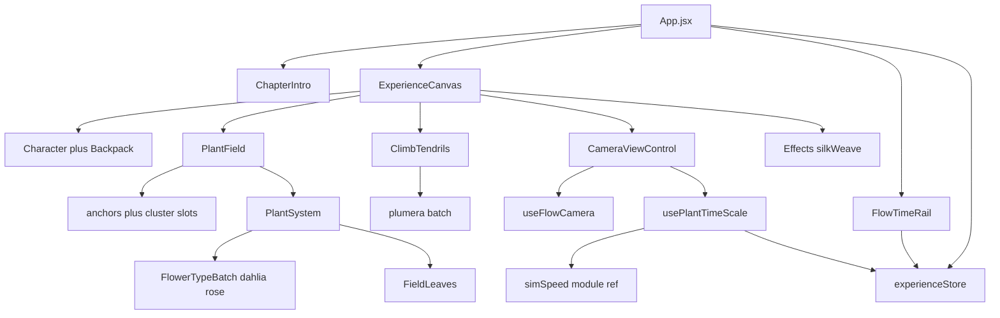

# Refactor & optimization

Backlog for Chapter 3 Still. Do not treat this as a license to change look, camera grammar, or plant-field behavior. Each phase is a separate, measurable change.

Visitor product (do not regress):

- Chapter overlay → Enter → FLOW intro (~20s) → live orbit
- Mouse Y after intro: plant time 0×–8×. Wheel: XZ radius. Mouse X is not wired.
- **D** toggles FLOW ↔ Explore. No mode bar. No Frames UI.
- `/debug` skips the overlay, auto-starts, shows Leva and stats-gl
- TIME rail is display-only (`pointer-events: none`)

Plant-pipeline invariants live in [`src/components/plants/field/README.md`](src/components/plants/field/README.md). This file is the project backlog only.

---

## Architecture

Live scene ([`src/app/ExperienceCanvas.jsx`](src/app/ExperienceCanvas.jsx)):

- Character tableau + backpack, both reporting bounds into the field group (`y = -1`)
- `PlantField` (dahlia + rose) and `ClimbTendrils` (plumera) — two full plant pipelines
- Shadow catcher, directional light, AdaptiveDpr, silk-weave post
- Camera: FLOW orbit + Explore `CameraControls`

Time is split on purpose today:

- Simulation reads `getSimSpeed()` in [`simSpeed.js`](src/components/plants/lifecycle/simSpeed.js)
- TIME rail reads `plantTimeScale` from Zustand
- `usePlantTimeScale` keeps them in sync from camera mode (FLOW pointer Y, Explore stillness)

`/debug` is a pathname convention ([`src/core/debugRoute.js`](src/core/debugRoute.js)), not a router. It skips intro, auto-starts, shows Leva, and mounts stats-gl.

Coupling to unwind later:

- [`experienceStore.js`](src/core/experienceStore.js) imports `getInitialCameraMode` from [`cameraModes.js`](src/components/camera/cameraModes.js) (core → components)
- Leva panels mount even on the visitor path (hidden unless `/debug` or `h`)

---

## Phase A — Dead surface

Low risk. Delete or archive what is unmounted. Grep before each removal.

### Camera leftovers

| Item | Path | Action |
|------|------|--------|
| Mode bar | `src/ui/cameraModeBar/` | Delete. Not mounted in `App.jsx`. |
| Frames hook | `src/components/camera/hooks/useFrameCamera.js` | Delete. |
| Authored frames | `FRAME_SHOTS` in `src/components/camera/cameraShots.js` | Delete. Keep `pointOnOrbit`, `flowOverheadPose`, `FLOW_OVERHEAD`. |
| Unused pose | `flowStartPose`, `FLOW_START` | Delete if still unused. |
| Frames comments | `src/components/plants/lifecycle/simSpeed.js` | Strip FRAMES wording. |

### Unmounted subsystems

| Item | Path | Action |
|------|------|--------|
| Ground tendrils | `src/components/plants/groundTendrils/` | Delete or archive. Not in the canvas. Also drops `tendrils/treeTendrilSystem.js`. |
| Smoke | `src/components/smoke/` | Delete or archive. |
| Standalone stem | `ProceduralStem.jsx`, `VatFlower.jsx`, `StemLeaves.jsx`, `stem/flowerLifecycle.js` | Delete if no scene mount remains. |
| Surround helper | `src/components/plants/field/surroundLayout.js` | Delete (zero imports). |
| Unused import | `Environment` in `ExperienceCanvas.jsx` | Remove. |

Jasmine is in `FLOWER_TYPES` but unused by the live field/climb mix. Drop it from the live set, or leave a one-line comment that it is reserved.

### Store and Leva leftovers

- `isMobile` is written in `App.jsx` and never read from the store (intro takes a prop).
- `setTier1Targets` / `areTier1TargetsReady` are unused outside the store.
- Backpack and Character both register Leva folder `'Character'` — rename Backpack to `'Backpack'` or nest it.

### Unused npm dependencies

Grep `src/` and `packages/` before uninstalling. Current suspects with zero app imports:

`@mui/material`, `@emotion/react`, `@emotion/styled`, `wouter`, `valtio`, `r3f-perf`, `@react-three/postprocessing`, `@react-three/rapier`, `gl-noise`, `maath`, `three-custom-shader-material`.

Keep `gsap` until Phase C decides whether intro progress moves to `useFrame`. Keep `stats-gl` (debug overlay). Keep `three-mesh-bvh`.

`packages/three-core` exports a lot the app never mounts (`PostFX`, `WebGpuPerf`, `Bgm`, leap, water). Do not prune the package in the same PR as app dead code.

---

## Phase B — Performance

Goal: visitor FPS on the production path, measured on `/debug` with stats-gl before and after. The silk-weave + dual plant pipelines are the main cost, not the TIME rail.

### B1. Confirm the render loop

[`Effects.tsx`](src/components/scene/Effects.tsx) calls `PostProcessing.render()` every frame. Check whether R3F still draws the default pass. If both run, disable the unused one (advance override or `gl.autoClear` / frameloop ownership). This is the highest-leverage unknown.

### B2. Silk weave

[`silkWeaveDefaults.js`](src/components/postfx/silkWeaveDefaults.js): `threadCount: 815`, full-screen, every pixel. `enabled` only mixes the uniform — the shader still runs.

- Skip `postProcessing.render()` in JS when disabled
- Production preset: lower `threadCount` (try 400–500) or a half-res weave pass
- Gate `preserveDrawingBuffer: true` in [`ExperienceCanvas.jsx`](src/app/ExperienceCanvas.jsx) to capture / `/debug` (it is always on for `CanvasCapture`)

### B3. Plant CPU (field)

[`fieldDefaults.js`](src/components/plants/field/fieldDefaults.js) already notes `flowerCount: 256` was sized for a dormant-plant gate that no longer exists. Built count = visible count. Retune downward (try 120–180) and watch layout shortfall warnings.

[`PlantSystem.jsx`](src/components/plants/field/PlantSystem.jsx) `useFrame` (priority 1), up to 256 plants:

- Lifecycle + wind + migration hearts + respawn
- Full `plantData` `DataTexture` upload every frame
- `updateFlowerBatchTips` (`curve.getPointAt` / `getTangentAt` per head)
- Object literals / spreads on hop and respawn (reuse a sample object)
- `scene.traverse` until a directional light is found — cache it

Layout-time: `buildAnchorClusterSlots` can BVH-probe up to 40 tries × flowerCount. Any Leva stem/field tweak rebuilds all tubes then `mergeGeometries`.

Leaves: `FieldLeaves` is `flowerCount × leafCount` instances (256 × 2 = 512 at defaults). All plant meshes use `frustumCulled={false}`.

### B4. Climb (second pipeline)

[`ClimbTendrils.jsx`](src/components/plants/climb/ClimbTendrils.jsx) duplicates the field runtime (merged stems, plantData, VAT, leaves, lifecycle `useFrame`).

- [`buildWrapCurve.js`](src/components/plants/climb/buildWrapCurve.js) always attaches `debug` payloads (Vector3 clones). Gate behind a flag.
- [`ClimbDebug.jsx`](src/components/plants/climb/ClimbDebug.jsx) still runs memos when `visible={false}` because hooks sit above the early return.
- Shared `useDirectionalLightDir()` for field + climb (+ any leftover stem).

### B5. Later perf (only after B1–B4 measure)

- Throttle heart hops / cache `sampleAnchorField` at heart positions
- Upload dirty plant-data rows only
- Stem LOD: fewer segments on echo-role stems
- Bake density to a coarse grid instead of CPU `sampleAnchorField` per hop
- Frustum strategy for the field group if the camera pulls back

---

## Phase C — Structural refactor

Split files and straighten deps. No look change.

### Plants

| File | Issue | Split toward |
|------|--------|----------------|
| `PlantField.jsx` (~523) | Leva + layout + debug + `buildStem` | `useFieldControls.js`, `fieldStemLayout.js`, keep the mount thin |
| `PlantSystem.jsx` (~523) | Merge + texture + migration + frame | `heartRuntime.js`, `migrationFrame.js` |
| Three copies of field-sampler options in `PlantField.jsx` | `anchorFieldOptions` / `anchorSamplerOptions` / `migration.options` | One `fieldSamplerOptions` memo |
| `ClimbTendrils.jsx` (~753) | Whole second runtime | Stem build, attachments, frame loop |
| `buildWrapCurve.js` (~728) | BVH snap + wraps + debug | Snap vs wrap; debug optional |
| `createFlowerMaterials.js` (~511) | Stem / petal / mask in one hub | One module per material family |

Unify field + climb shared runtime only after both are split; do not merge them first.

### Camera and store

- Extract intro constants + easing from [`useFlowCamera.js`](src/components/camera/hooks/useFlowCamera.js) (`INTRO_DURATION`, `INTRO_TURNS`, `easeInRest`, `sineInOut`). Optional: drive `intro.p` in `useFrame` and drop `gsap` (only consumer).
- `introDoneRef`, `intro.p`, and `flowIntroDone` overlap — pick one source of truth for “intro finished”.
- Move `usePlantTimeScale` fully under `plants/lifecycle`; the camera folder should not own the time director.
- Invert [`experienceStore.js`](src/core/experienceStore.js) → [`cameraModes.js`](src/components/camera/cameraModes.js). Mode constants belong next to the store, or the store defaults to `'flow'` without importing components.
- Extract D-key toggle from `CameraViewControl.jsx` if that file stays a grab-bag.

### Leva

Match the camera/field pattern:

- `postfxControls.js` (schema currently inline in `Effects.tsx`)
- `sceneControls.js` (Scene + Sim currently inline in `ExperienceCanvas.jsx`)
- Collapse Plant Wind by default
- Mount plant/climb/stem folders only on `/debug` if hook cost or panel clutter matters. Visitor already starts with Leva hidden off-debug.

---

## Suggested order

1. **A** — delete dead UI and unmounted folders; prune unused deps. No visual change.
2. **B1–B2** — render loop + silk weave. Measure FPS.
3. **B3** — `flowerCount` retune + `PlantSystem` hot-path allocations. Measure again.
4. **B4** — climb debug payloads + shared light hook.
5. **C** — file splits and store/camera deps. Behavior frozen.

Do not combine a look-changing retune (`flowerCount`, `threadCount`) with a structural split in the same change.

Measure FPS on `/debug` with stats-gl before and after Phase B.

---

## Out of scope unless asked

- Wiring mouse X to orbit
- Bringing back FLOW / Explore / Frames chrome
- Rewriting the anchor field or migration rules
- Pruning `@core` exports
- New markdown besides this file and the existing field README
